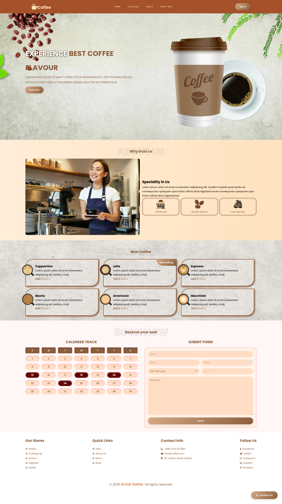

# ☕ Coffee House

A simple and responsive coffee shop landing page built with **HTML** and **CSS**.

This project was created as part of my web development learning journey. The goal was to practice building a modern website layout, using Flexbox, CSS Grid, responsive design, and smooth navigation.

## ✨ Features

* Responsive design
* Modern coffee shop UI
* Hero section
* About section
* Menu section
* Customer reviews
* Contact/Booking form
* Smooth scrolling navigation

## 🛠️ Built With

* HTML5
* CSS3
* Font Awesome

## 🚀 Getting Started

1. Clone the repository

```bash
git clone https://github.com/arnobsark/coffee-house.git
```

2. Open the project folder.

3. Open `index.html` in your browser.

That's it!


## 📷 Preview

<p align="center">
  
</p>

## 🖼️ Image Credits

Some images and icons used in this project are sourced from:

* Magnific — https://magnific.com/
* TopPNG — https://toppng.com/
* Flaticon — https://flaticon.com/

All rights to their respective owners.


